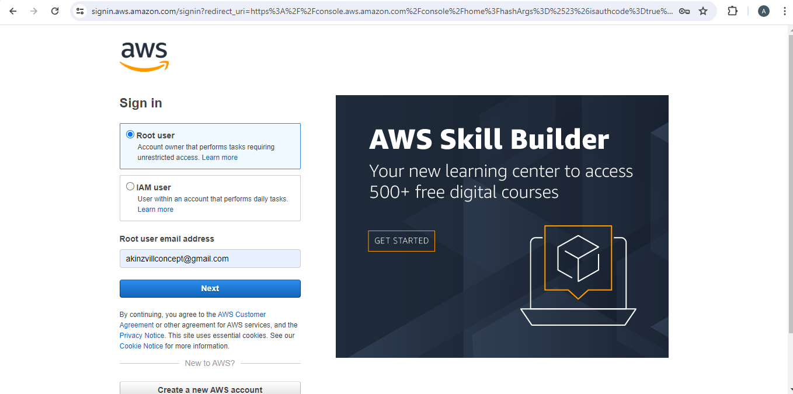
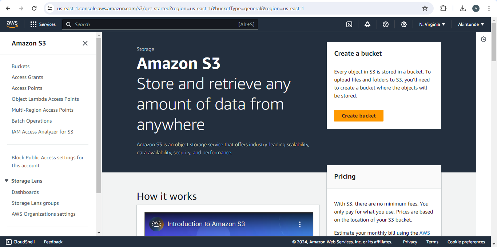
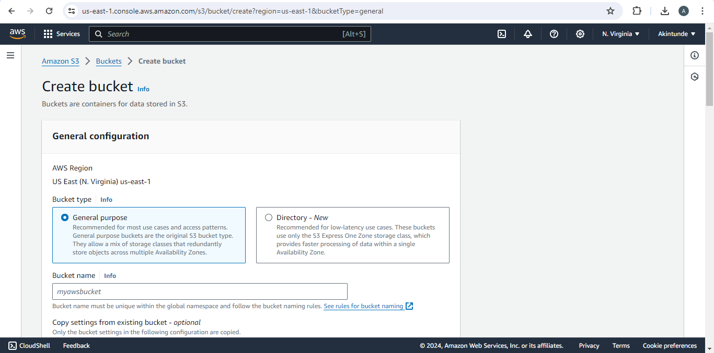
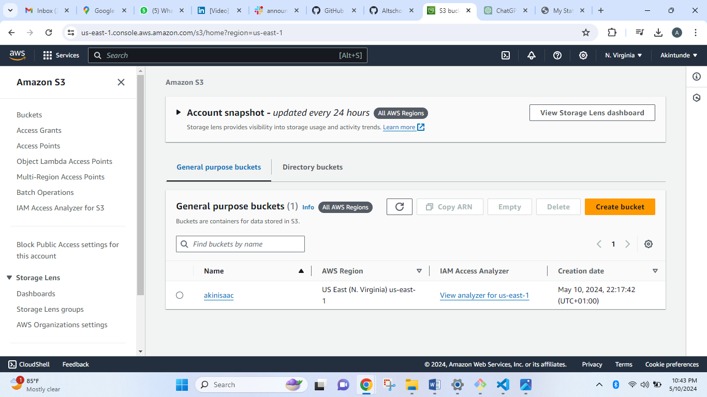
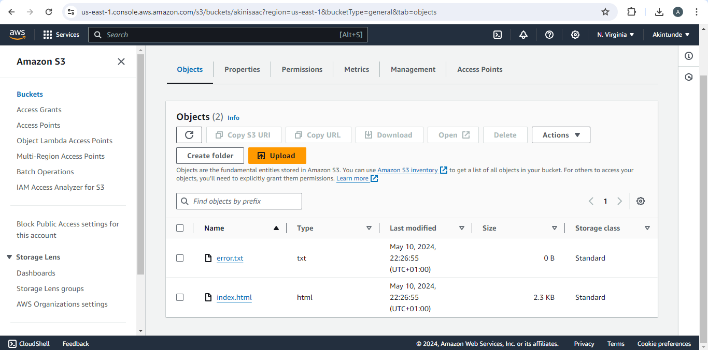
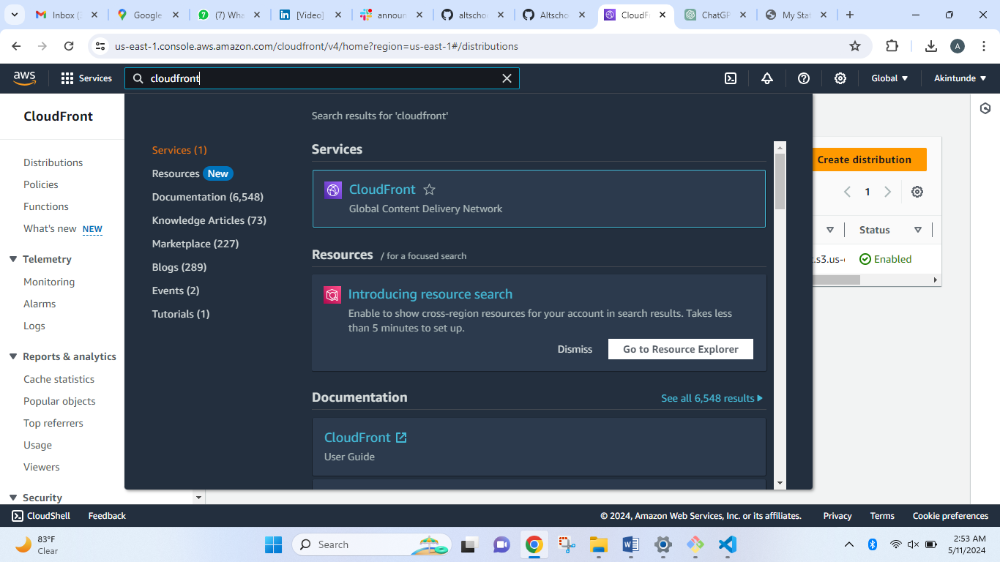
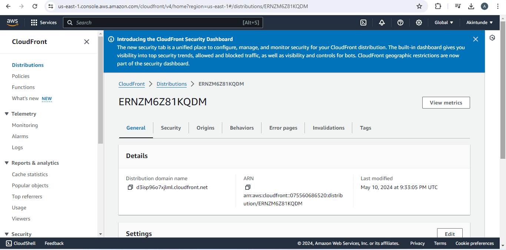
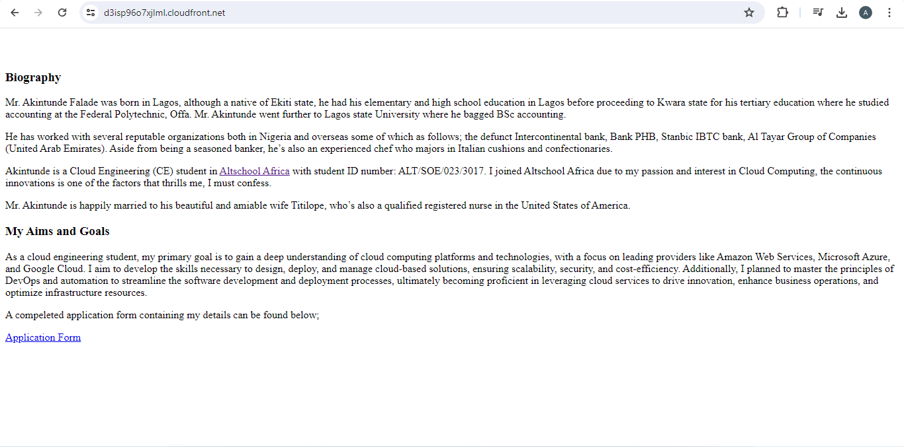

This excersise is the first assignment in 3rd semester at Altschool, below is the question;

# Create a static website and host it on S3 bucket, using cloudfront

# Below is the overview Of Task Execution

In this document, I wll outline the steps required to deploy a static website hosted on a private s3 bucket on AWS and using CloudFront as CDN to display the web contents

Task

1. Login to your AWS account via root user

2. Search for s3 to create a bucket

3. Click on 'create bucket' to set up a bucket

4. Set up bucket by inputting bucket name

5. Image 5 displays the bucket user after creation

6. Upload HTML document to be displayed on web

7. Search for cloudfront on the search engine

8. Set up cloudfront details and generate policy / distribution domain name

9. Copy distribution domain name URL and paste in a web browser to display the web page

