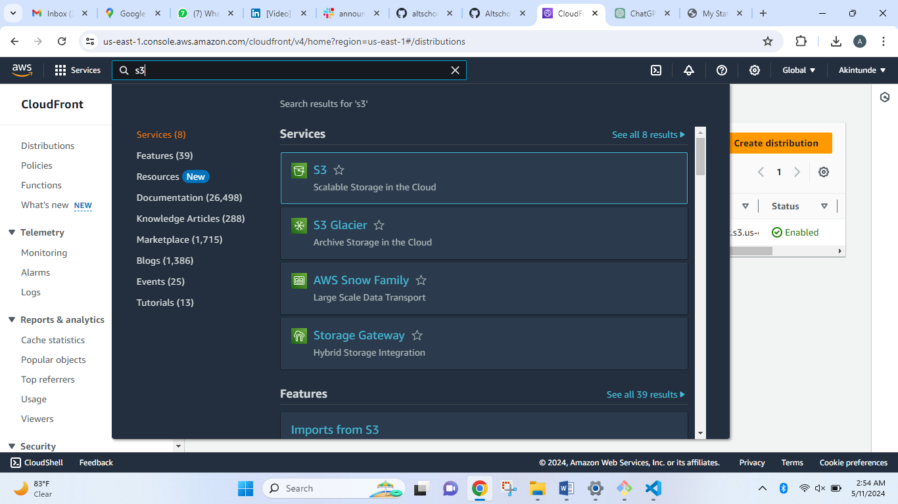

This excersise is the first assignment in 3rd semester at Altschool, below is the question;

# Create a static website and host it on S3 bucket, using cloudfront

# Below is the overview Of Task Execution

In this document, I wll outline the steps required to deploy a static website hosted on a private s3 bucket on AWS and using CloudFront as CDN to display the web contents

Task

1. Login to your AWS account via root user

2. Search for s3 to create a bucket

